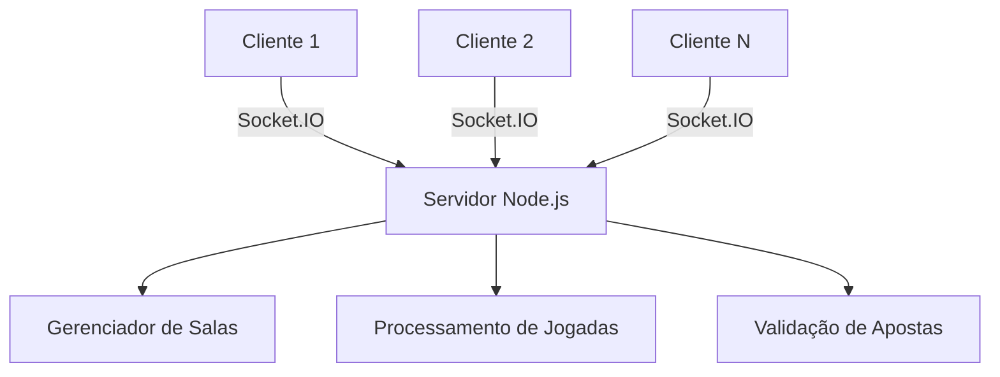

# 🎲 Dados da Sorte - Jogo Multiplayer Online

**Um emocionante jogo de dados multiplayer em tempo real!**

[](https://nodejs.org/)
[](https://socket.io/)
[](https://expressjs.com/)

## 🎯 Sobre o Jogo

Dados da Sorte é um jogo de **cassino multiplayer** onde os jogadores fazem apostas em tempo real e competem uns contra os outros. O jogo utiliza **Socket.IO** para sincronização instantânea entre todos os jogadores conectados.

### 🌟 Características Principais

- 🎲 **100% Multiplayer** - Não há modo single player
- 🏠 **3 Salas Diferentes** - Principal, VIP e Iniciante
- 👥 **Até 10 Jogadores** por sala simultaneamente
- 🎪 **Sistema de Dealer** - Primeiro jogador vira dealer
- 💰 **Apostas em Tempo Real** - Veja as apostas de outros jogadores
- 🎯 **Sincronização Perfeita** - Dados lançados simultaneamente para todos

## 🚀 Instalação e Execução

### Pré-requisitos
- **Node.js 18+**
- **NPM** (incluído com Node.js)
- **Navegador moderno** (Chrome, Firefox, Safari, Edge)

### Passos para Executar

1. **Clone ou baixe o projeto**
```bash
git clone <repository-url>
cd dados-da-sorte
```

2. **Instale as dependências**
```bash
npm install
```

3. **Execute o servidor**
```bash
npm start
```

4. **Abra o jogo no navegador**
```
http://localhost:3000
```

## 🏠 Sistema de Salas

| 🏠 Sala | 💰 Aposta Min | 💰 Aposta Max | 👥 Max Jogadores |
|---------|---------------|---------------|------------------|
| 🟢 **Mesa Principal** | R$ 50 | Sem limite | 8 jogadores |
| 🟤 **Mesa VIP** | R$ 500 | Sem limite | 6 jogadores |
| 🟣 **Mesa Iniciante** | R$ 10 | R$ 1.000 | 10 jogadores |

## 🎮 Como Jogar

### 1. **Conecte-se a uma Sala**
- Escolha uma sala disponível no seletor
- Aguarde a conexão ser estabelecida
- Você será automaticamente colocado na mesa

### 2. **Sistema de Dealer**
- O **primeiro jogador** na sala vira **dealer** 🎲
- Apenas o **dealer pode rolar os dados**
- Se o dealer sair, outro jogador assume automaticamente

### 3. **Faça suas Apostas**
- Selecione o valor da ficha
- Clique em **"APOSTE AQUI"** na mesa
- Veja as apostas de outros jogadores em tempo real

### 4. **Lance os Dados** (Se você for o dealer)
- Clique em **"ROLAR DADOS"**
- Os dados são lançados para todos simultaneamente
- Veja os resultados e ganhos/perdas

### 5. **Gerencie seu Saldo**
- Apostas são validadas pelo servidor
- Saldos são atualizados automaticamente
- Use **"LIMPAR APOSTAS"** para cancelar apostas

## 🎨 Interface Visual

- **👥 Indicadores de Jogadores:** Círculos dourados mostram outros jogadores
- **🎲 Status do Dealer:** Indicação clara de quem pode rolar os dados
- **💫 Animações:** Fichas voando quando alguém aposta
- **📊 Informações da Sala:** Dados atualizados em tempo real

## 🛠️ Tecnologias Utilizadas

### Backend
- **Node.js** - Runtime JavaScript
- **Express.js** - Framework web
- **Socket.IO** - Comunicação em tempo real

### Frontend
- **CreateJS** - Engine de jogos 2D
- **Socket.IO Client** - Comunicação com servidor
- **jQuery** - Manipulação DOM

## 📡 Arquitetura do Sistema



### Fluxo do Jogo
1. **Jogadores conectam** → Escolhem sala → Entram na mesa
2. **Fazem apostas** → Servidor valida → Sincroniza com todos
3. **Dealer rola dados** → Servidor processa → Envia resultado
4. **Saldos atualizados** → Nova rodada começa

## 🔧 API do Servidor

### Endpoints REST
- `GET /` - Interface do jogo
- `GET /api/rooms` - Status das salas em tempo real

### Eventos Socket.IO
- `join_room` - Entrar em uma sala
- `place_bet` - Fazer aposta
- `roll_dice` - Rolar dados (apenas dealer)
- `clear_bets` - Limpar apostas
- `leave_room` - Sair da sala

## 🔒 Segurança e Validação

- ✅ **Validação Server-side** de todas as ações
- ✅ **Prevenção de trapaças** - dados gerados no servidor
- ✅ **Limites de aposta** aplicados automaticamente
- ✅ **Estado sincronizado** sempre consistente

## 📁 Estrutura do Projeto

```
/
├── server.js                 # Servidor Node.js principal
├── package.json             # Dependências e scripts
├── game/                    # Arquivos do cliente
│   ├── index.html          # Interface principal
│   ├── js/                 # Scripts do jogo
│   │   ├── CGame.js        # Lógica principal
│   │   ├── CSocketManager.js    # Gerenciador Socket.IO
│   │   ├── CMultiplayerGame.js  # Controlador multiplayer
│   │   └── ...             # Outros scripts
│   ├── css/                # Estilos
│   ├── sounds/             # Efeitos sonoros
│   └── sprites/            # Imagens do jogo
├── MULTIPLAYER_GUIDE.md    # Guia detalhado
└── CHANGELOG_MULTIPLAYER.md # Histórico de mudanças
```

## 🚨 Requisitos do Sistema

### Servidor
- **CPU:** 1+ core
- **RAM:** 512MB+
- **Rede:** Conexão estável com internet

### Cliente
- **Navegador:** Chrome 70+, Firefox 65+, Safari 12+, Edge 79+
- **JavaScript:** Habilitado
- **WebSocket:** Suporte nativo

## 🎯 Solução de Problemas

### ❌ Não consegue conectar
```bash
# Verificar se o servidor está rodando
curl http://localhost:3000/api/rooms

# Reiniciar servidor se necessário
npm start
```

### ❌ Desconectado durante o jogo
- ✅ **Servidor obrigatório** - O jogo não funciona offline
- ✅ Recarregue a página para reconectar
- ✅ Verifique se o servidor não foi interrompido

### ❌ Não consegue rolar dados
- ✅ Verifique se você é o **dealer** (ícone 🎲)
- ✅ Certifique-se de que há **apostas ativas**
- ✅ Aguarde outros jogadores terminarem de apostar

## 🎉 Contribuição

Este é um projeto de jogo multiplayer. Para contribuir:

1. Fork o repositório
2. Crie uma branch para sua feature
3. Implemente as mudanças
4. Teste com múltiplos jogadores
5. Envie um Pull Request

## 📄 Licença

Este projeto está licenciado sob a [Licença MIT](LICENSE).

## 🎊 Créditos

- **Engine:** CreateJS para renderização 2D
- **Comunicação:** Socket.IO para tempo real
- **Servidor:** Node.js + Express.js
- **Design:** Interface adaptada para multiplayer

---

## 🎲 Começar a Jogar Agora!

1. **Execute:** `npm start`
2. **Acesse:** `http://localhost:3000`
3. **Escolha uma sala** e comece a jogar!
4. **Divirta-se** com outros jogadores online!

**🎯 Boa sorte nas mesas! 🎯**